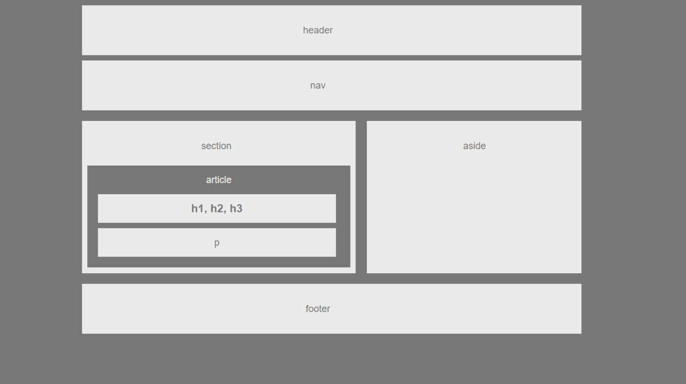
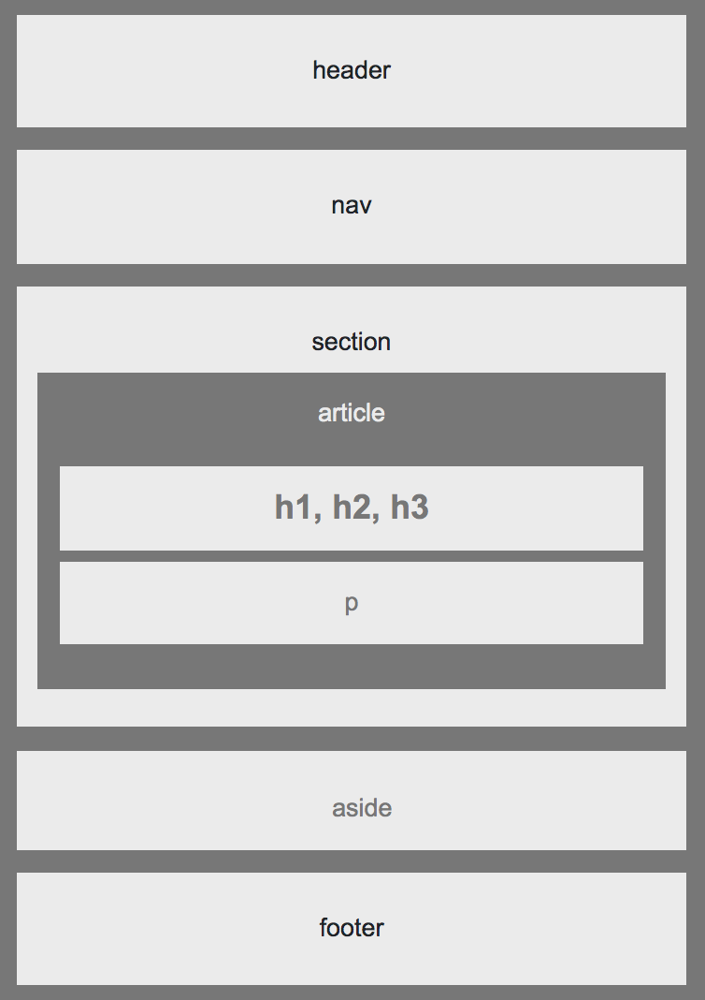
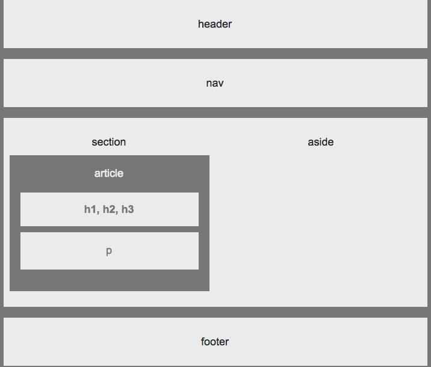

# utbc2019-hw-01-wireframe - Building a Wireframe

## Overview

In this assignment, we build a web design skeleton using HTML/CSS. The completed work looks like this:

## Specification

The full problem assignment can be found [here](https://github.com/the-Coding-Boot-Camp-at-UT/UTAUS201902FSF5/blob/master/01-html-git-css/02-Homework/Instructions/easier-homework-assignment.md).

## Demo Day!

The hosted solutions resides [here](https://zenglenn42.github.io/utbc2019-hw-01-wireframe/).

## Extra Credit

You'll notice on the master branch that the design is not responsive since the body and sections widths are
hard-coded to 960px and 495px respectively, per the problem specification.

However, today, it's all about being responsive and so I crafted a design in the branch:

   bootstrap-grid-layout

that morphs gracefully to a variety of viewport geometries.

So on phone-sized viewports, you see something like this:

Interestingly, my initial bootstrap rollout regressed on desktop viewports to something that lacked
column gutters in the main content area between the 'section' and 'aside' elements:

