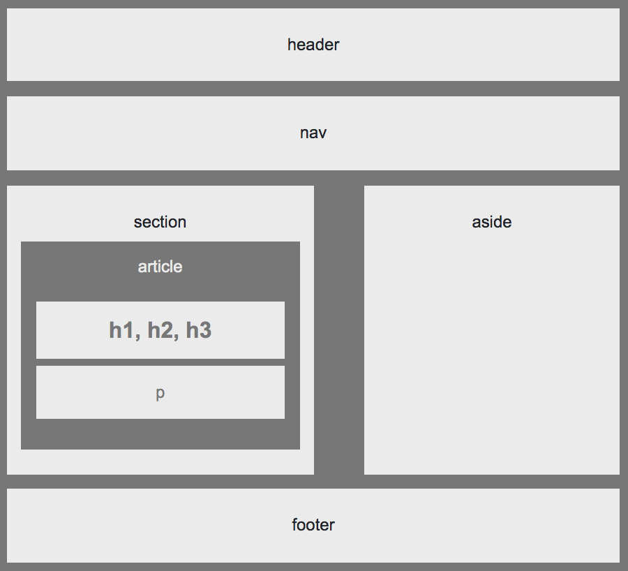

# utbc2019-hw-01-wireframe - Building a Wireframe

## Overview

In this assignment, we build a web design skeleton using HTML/CSS. The completed work looks like this:


## Specification

The full problem assignment can be found [here](https://github.com/the-Coding-Boot-Camp-at-UT/UTAUS201902FSF5/blob/master/01-html-git-css/02-Homework/Instructions/easier-homework-assignment.md).

## Demo Day!

The hosted solutions resides [here](https://zenglenn42.github.io/utbc2019-hw-01-wireframe/).

## Extra Credit

You'll notice on the master branch that the design is not responsive since the body and sections widths are
hard-coded to 960px and 495px respectively, per the problem specification.

However, today, it's all about being responsive and so I crafted a design in the branch:

```
   bootstrap-grid-layout
```

that morphs gracefully to a variety of viewport geometries.

So on phone-sized viewports, you see something like this:


Interestingly, my initial bootstrap rollout regressed on desktop viewports to something that lacked
column gutters in the main content area between the 'section' and 'aside' elements:


I wrestled that issue into submission [here](https://github.com/zenglenn42/utbc2019-hw-01-wireframe/issues/1) by background clipping to the content-box of the aside element and adjusting the vertical and right padding accordingly.

That seemed a bit anit-pattern for bootstrap, so I simply tried expressing the 'section' and 'aside' elements as col-md-6 and col-md-5 respectively.  That was responsive, but yielded an overly generous gutter on tablet and desktop form-factors:



In the end, I opted for my more exotic fix with content-clipping since it was the most visually pleasing.  If I had a full SCSS build environment, I might be able to horse-whisper the default bootstrap gutter margins more expertly.
